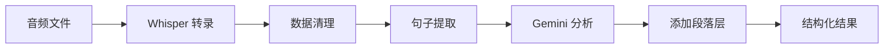

# Simple Audio Processing Pipeline

一个完整的音频处理流水线，用于将音频文件转录为文本并进行智能分析。该项目使用 Whisper 进行语音识别，通过 Gemini API 对转录内容进行深度分析和词汇解释，并添加段落结构化组织。

⏱️ gemini 时间统计:
总处理时间: 189.58 秒
平均批次时间: 36.84 秒
处理批次数: 23

## 功能特性

- 🎵 **多模型语音识别**: 支持多种 Whisper 模型 (WhisperX, OpenAI Whisper, Whisper Diarization 等)
- 🧹 **智能数据清理**: 自动清理和结构化转录数据
- 🤖 **AI 文本分析**: 使用 Gemini API 进行句子分析和词汇解释
- 📊 **Token 统计**: 自动统计每个句子和整体的 token 数量
- 🔢 **索引管理**: 统一管理句子和 token 索引，确保从0开始的连续编号
- 📑 **段落结构**: 支持将句子组织成段落，为更复杂的文档结构做准备
- ⏰ **时间信息保留**: 自动保留原始音频的时间戳信息（start/end时间）
- 🔄 **并行处理**: 支持批量并行处理提高效率
- 🔐 **安全配置**: API 密钥通过环境变量管理
- 📊 **完整流水线**: 从音频文件到结构化分析结果的一站式处理

## 项目结构

```
.
├── main.py                    # 主流水线脚本
├── 0video_to_audio.py         # 视频转音频工具
├── 1whisper.py               # Whisper 语音识别模块
├── 2data-cleansing.py        # 数据清理模块
├── 3llm.py                   # LLM 分析模块
├── 4add_paragraph_layer.py   # 段落层结构添加模块
├── gemini.py                 # Gemini API 封装
├── models_config.py          # 模型配置文件
├── .env                      # 环境变量配置 (需要创建)
├── requirements.txt          # Python 依赖列表
├── .gitignore                # Git 忽略文件配置
└── README.md                 # 项目文档
```

### 输出目录结构

```
├── 原始媒体/                  # 音频文件存放目录
├── 1transcript-raw/          # Whisper 原始转录结果
├── 2cleaned-data/            # 清理后的结构化数据
├── 3llm/                     # LLM 分析结果
└── 4final/                   # 最终带段落结构的输出
```

## 安装和设置

### 1. 克隆项目

```bash
git clone <repository-url>
cd whisper
```

### 2. 创建虚拟环境

```bash
python -m venv venv
source venv/bin/activate  # Linux/Mac
# 或者
venv\Scripts\activate     # Windows
```

### 3. 安装依赖

```bash
pip install -r requirements.txt
```

或者手动安装：

```bash
pip install replicate>=0.15.0 google-genai>=0.6.0 python-dotenv>=1.0.0 pydantic>=2.0.0 moviepy>=1.0.3
```

#### 依赖说明

- **replicate**: Replicate API 客户端，用于调用 Whisper 模型
- **google-genai**: Google Gemini API 客户端，用于文本分析
- **python-dotenv**: 环境变量管理，用于安全存储 API 密钥
- **pydantic**: 数据验证和序列化，用于结构化 API 响应
- **moviepy**: 视频处理库，用于视频转音频功能

### 4. 配置 API 密钥

创建 `.env` 文件并填入你的 API 密钥：

```env
# Gemini API Configuration
GEMINI_API_KEY=your_gemini_api_key_here

# Replicate API Configuration
REPLICATE_API_TOKEN=your_replicate_token_here
```

#### 获取 API 密钥

- **Gemini API**: 访问 [Google AI Studio](https://makersuite.google.com/app/apikey) 获取
- **Replicate API**: 访问 [Replicate](https://replicate.com/account/api-tokens) 获取

### 5. 准备音频文件

将要处理的音频文件放入 `原始媒体/` 目录中。支持的格式：

- MP3, MP4, WAV, AVI, MOV 等

## 使用方法

### 快速开始

1. 将音频文件放入 `原始媒体/` 目录
2. 运行主流水线：

```bash
python main.py
```

### 自定义音频文件

main.py 现在支持参数化，你可以通过以下方式使用：

#### 方法 1: 修改代码中的文件路径

编辑 `main.py` 末尾的 `audio_file` 变量：

```python
if __name__ == "__main__":
    # 定义音频文件路径
    audio_file = "./原始媒体/your_audio_file.mp3"
    main(audio_file)
```

#### 方法 2: 在代码中调用函数

```python
from main import main

# 使用默认路径
main()

# 使用自定义音频文件
main("./path/to/your/audio.mp3")
```

#### 自动路径生成

系统会基于音频文件名自动生成所有输出路径：

- 输入: `./原始媒体/example.mp3`
- Whisper 输出: `1transcript-raw/example.json`
- 清理数据: `2cleaned-data/example-cleaned.json`
- LLM 分析: `3llm/example-cleaned-gemini.json`
- 最终结果: `4final/example-cleaned-gemini-final.json`

### 视频转音频工具

项目包含独立的视频转音频工具 `0video_to_audio.py`：

#### 函数调用方式

```python
from 0video_to_audio import convert_video_to_audio, batch_convert_videos

# 单文件转换 - 完整转换
convert_video_to_audio("video.mp4")

# 单文件转换 - 指定输出文件
convert_video_to_audio("video.mp4", "audio.mp3")

# 单文件转换 - 裁剪（从10秒到60秒）
convert_video_to_audio("video.mp4", "audio.mp3", "mp3", 10, 60)

# 批量转换
batch_convert_videos("./videos/", "./audios/")

# 批量裁剪转换（所有视频裁剪5-30秒）
batch_convert_videos("./videos/", "./audios/", "mp3", 5, 30)
```

#### 直接运行脚本

修改 `0video_to_audio.py` 文件末尾的参数：

```python
if __name__ == "__main__":
    # 修改这些参数
    video_path = "./原始媒体/your_video.mp4"
    output_path = "./原始媒体/your_audio.mp3"
    start = 0      # 开始时间（秒），None表示从头开始
    end = 180      # 结束时间（秒），None表示到结尾

    convert_video_to_audio(video_path, output_path, "mp3", start, end)
```

然后运行：

```bash
python 0video_to_audio.py
```

#### 函数参数说明

- `video_path`: 输入视频文件路径
- `output_path` (可选): 输出音频文件路径，不指定则自动生成
- `audio_format`: 输出音频格式，默认 "mp3"
- `start` (可选): 开始时间（秒），None 表示从头开始
- `end` (可选): 结束时间（秒），None 表示到结尾

#### 支持格式

- **输入视频**: MP4, AVI, MOV, MKV, FLV, WMV, M4V, WEBM
- **输出音频**: MP3（默认）

### 分步执行

你也可以单独运行各个模块：

#### 1. 语音识别

```bash
python 1whisper.py
```

#### 2. 数据清理

```bash
python 2data-cleansing.py
```

#### 3. LLM 分析

```bash
python 3llm.py
```

#### 4. 添加段落结构

```bash
python 4add_paragraph_layer.py
```

### 自定义配置

#### 选择 Whisper 模型

编辑 `1whisper.py` 中的 `USE_MODEL` 参数：

```python
USE_MODEL = 1  # 1=WhisperX, 2=OpenAI Whisper, 3=Whisper Diarization, etc.
```

#### 调整批处理大小

编辑 `3llm.py` 中的配置：

```python
DEFAULT_BATCH_SIZE = 10      # 每批次处理的句子数量
DEFAULT_MAX_WORKERS = 5      # 最大并行线程数
```

## 处理流程



### 详细步骤

1. **语音识别**: 使用 Whisper 模型将音频转换为带时间戳的文本
2. **数据清理**: 清理转录结果，去除无效数据，结构化输出
3. **句子提取**: 从清理后的数据中提取句子内容
4. **智能分析**: 使用 Gemini API 对英文句子进行：
   - 整句翻译/解释
   - 词汇分解和解释
   - 语法结构分析
   - 自动统计每句子和总体的 token 数量
   - 统一管理所有索引编号（从0开始）
   - 自动添加时间戳信息（start/end时间）到分析结果
5. **段落结构**: 添加 Paragraph 层，支持更复杂的文档结构组织

## 输出格式

最终输出的 JSON 文件包含详细的分析结果和段落结构：

```json
{
  "language": "en",
  "total_sentences": 3,
  "total_tokens": 28,
  "total_paragraphs": 3,
  "paragraphs": [
    {
      "index": 0,
      "total_sentences": 1,
      "sentences": [
    {
      "index": 0,
      "text": "Number one most racist country in Europe...",
      "explanation": "欧洲最种族主义的国家排名第一...",
      "start": 0.109,
      "end": 8.558,
      "total_tokens": 13,
      "tokens": [
        {
          "index": 0,
          "text": "Number one",
          "explanation": "排名第一"
        },
        {
          "index": 1,
          "text": "most racist",
          "explanation": "最种族主义的"
        }
      ]
    }]
    }
  ]
}
```

### 输出字段说明

- `total_sentences`: 总句子数
- `total_tokens`: 所有句子的 token 总数
- `total_paragraphs`: 总段落数
- `paragraphs[].index`: 段落编号（从0开始）
- `paragraphs[].total_sentences`: 段落内的句子数量
- `paragraphs[].sentences[].index`: 句子在整个文本中的编号（从0开始）
- `paragraphs[].sentences[].start`: 句子在音频中的开始时间（秒）
- `paragraphs[].sentences[].end`: 句子在音频中的结束时间（秒）
- `paragraphs[].sentences[].total_tokens`: 当前句子的 token 数量
- `paragraphs[].sentences[].tokens[].index`: token 在当前句子中的编号（从0开始）

## 技术架构

### 模块职责分离

**gemini.py**:
- 专注于纯文本分析和语言处理
- 不处理索引逻辑，由 Gemini API 返回无索引的结构化数据
- 提供 Pydantic 模型验证确保数据质量

**3llm.py**:
- 统一管理所有索引分配（句子索引、token 索引）
- 负责 token 数量统计（单句和总体）
- 处理批次分组和并行执行
- 数据整合和输出格式化
- 根据索引自动添加时间戳信息（start/end时间）

**4add_paragraph_layer.py**:
- 将句子组织成段落结构
- 为文档添加更高层级的组织
- 支持未来的多段落、多层级文档结构
- 生成最终的带完整层级的输出格式

这种设计确保了职责清晰，gemini.py 专注于 AI 分析，3llm.py 负责数据组织，4add_paragraph_layer.py 负责文档结构化。

## 常见问题

### Q: 支持哪些音频格式？

A: 支持 MP3, MP4, WAV, AVI, MOV 等常见格式。

### Q: 如何更改处理的音频文件？

A: 有两种方法：

1. 修改 `main.py` 末尾 `if __name__ == "__main__":` 块中的 `audio_file` 变量
2. 在代码中直接调用 `main("./path/to/your/audio.mp3")`

### Q: API 调用失败怎么办？

A: 检查：

1. API 密钥是否正确设置
2. 网络连接是否正常
3. API 服务是否正常

### Q: 如何提高处理速度？

A: 可以调整 `3llm.py` 中的并行参数：

- 增加 `DEFAULT_MAX_WORKERS`
- 调整 `DEFAULT_BATCH_SIZE`

## 贡献

欢迎提交 Pull Request 或创建 Issue 来改进项目。

## 许可证

MIT License

## 联系方式

如有问题请创建 GitHub Issue。
