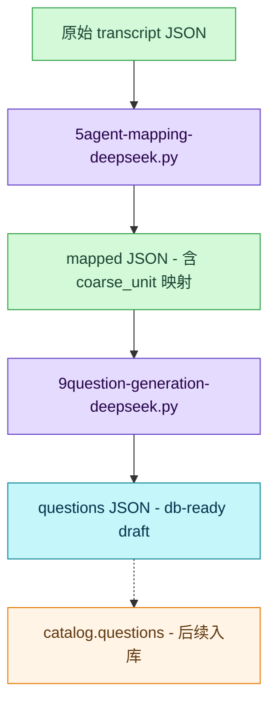
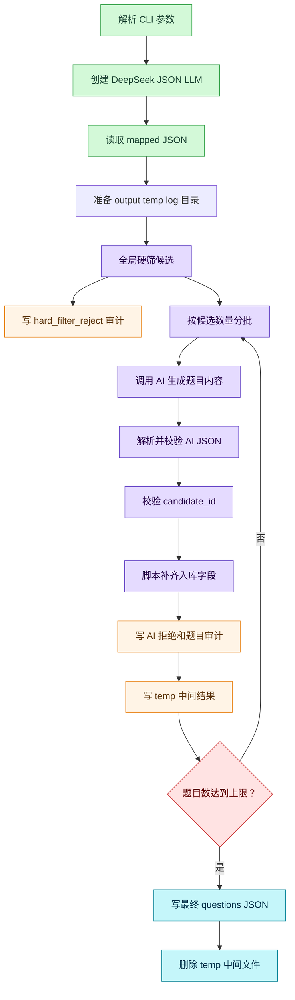
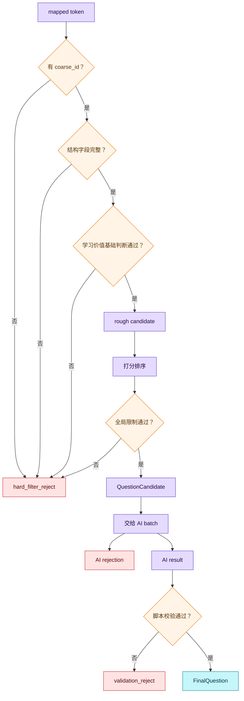
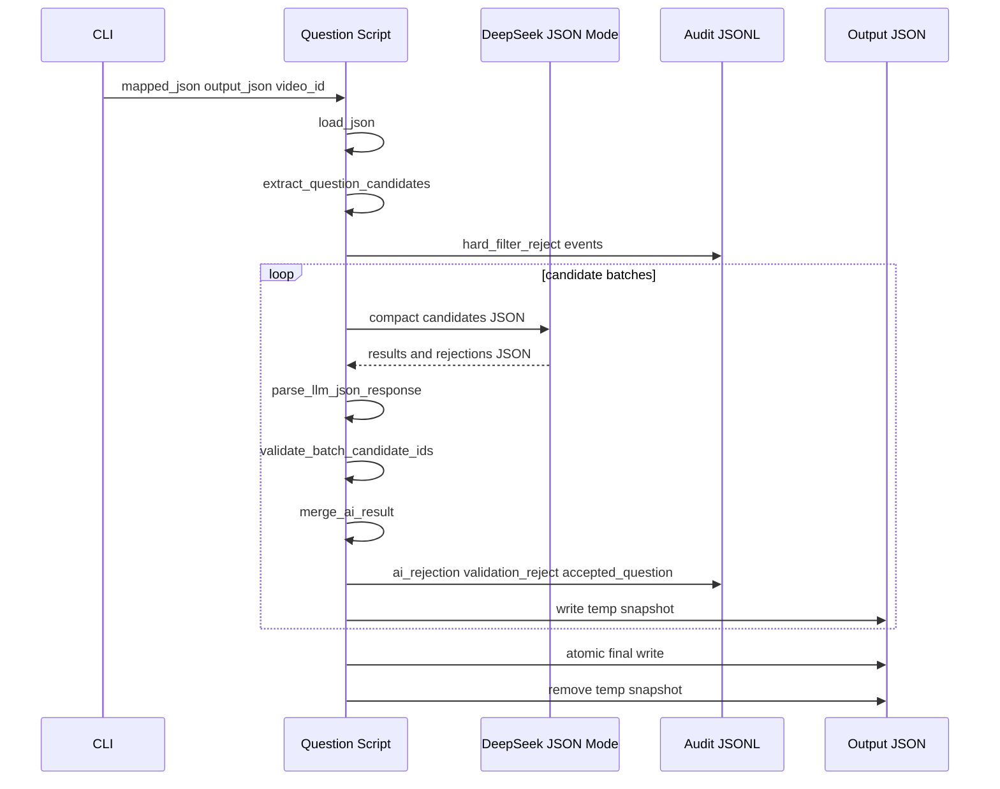
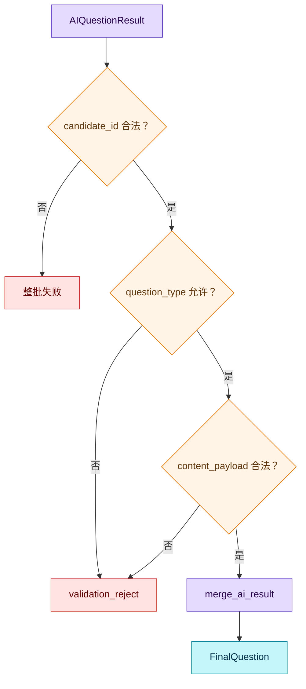

# 题目生成流程

本文面向第一次接触 `9question-generation-deepseek.py` 的新人，解释这个脚本从 mapped transcript JSON 到题目 JSON 的完整语义链路。

一句话概括：

```text
它不是重新理解视频字幕，而是在已有 coarse_unit 映射结果上，筛出适合练习的上下文词项，让 AI 只生成题目内容，再由脚本补齐稳定的入库字段。
```

---

## 一、脚本定位

`9question-generation-deepseek.py` 位于 `5agent-mapping-deepseek.py` 之后。

前一个脚本负责：

- 把 transcript token 合并成学习导向的 semantic token；
- 给 token 写 `explanation`、`semantic_element.translation`、`semantic_element.dictionary`；
- 尽可能把 token 映射到 `semantic.coarse_unit`；
- 在成功映射时写入 `coarse_id`、`kind`、`pos` 和稳定释义。

题目生成脚本只处理已经映射好的结果：

- 只考虑 `semantic_element.coarse_id != null` 的 token；
- 只生成视频上下文题；
- 不直接写数据库；
- 输出可入 `catalog.questions` 的 db-ready JSON；
- 默认题目状态是 `draft`。

整体位置如下：



---

## 二、运行入口

单文件生成：

```bash
.venv/bin/python 9question-generation-deepseek.py \
  resource/The\ Office\ BD/mapped/clip1.json \
  resource/The\ Office\ BD/questions/clip1.json \
  --video-id 00000000-0000-0000-0000-000000000001
```

常用参数：

| 参数 | 默认值 | 语义 |
| --- | --- | --- |
| `mapped_json` | 无 | 输入 mapped JSON 文件。 |
| `output_questions_json` | 无 | 输出题目 JSON 文件。 |
| `--video-id` | 必填 | 写入每道 `video_unit` 题的 `catalog.videos.video_id`。 |
| `--max-questions` | `20` | 最终最多生成多少道题。 |
| `--question-types` | `context_meaning_choice,context_cloze_choice` | 允许生成的题型。 |
| `--batch-size` | `10` | 每次交给 AI 的候选数量。 |
| `--env-path` | `.env` | 读取 `DEEPSEEK_API_KEY` 和可选 `DEEPSEEK_BASE_URL`。 |
| `--model` | `deepseek-v4-pro` | 题目生成模型。 |

批量生成用 `9question-generation-batch.py`。它的默认输入目录是 `resource/The Office BD/mapped`，默认输出目录是 `resource/The Office BD/questions`。

---

## 三、输入语义

输入必须是 `5agent-mapping-deepseek.py` 的正式输出结构。题目脚本依赖以下字段：

```json
{
  "sentences": [
    {
      "index": 14,
      "text": "The most sacred thing I do is care and provide for my workers.",
      "translation": "我做的最神圣的事情，就是关心并供养我的员工。",
      "start": 17621,
      "end": 30899,
      "tokens": [
        {
          "index": 17,
          "text": "sacred",
          "explanation": "在这里是比喻用法，表示非常重要、不可轻视。",
          "start": 26120,
          "end": 26489,
          "semantic_element": {
            "coarse_id": 138446,
            "base_form": "sacred",
            "translation": "神圣（宗教或比喻）",
            "dictionary": "表示被视为神圣或应受特殊、不可侵犯的尊重。",
            "kind": "word",
            "pos": "adjective",
            "reason": "语义可靠匹配。"
          }
        }
      ]
    }
  ]
}
```

关键含义：

- `sentence.index`：题目定位到哪一句字幕。
- `sentence.text`：上下文题展示的原句来源。
- `sentence.translation`：帮助 AI 理解上下文，不直接写入最终题目字段。
- `sentence.start/end`：最终写入 `context_start_ms/context_end_ms`。
- `token.index`：最终写入 `context_span_index`。
- `token.text`：清理后作为 `target_text`。
- `token.explanation`：帮助 AI 判断当前语境下的含义。
- `semantic_element.coarse_id`：学习系统真正追踪的 unit id。
- `semantic_element.translation`：给 AI 的简短中文标签，可作为正确选项参考。
- `semantic_element.dictionary`：给 AI 的稳定词典释义，用于理解但通常不直接展示。

---

## 四、总体流程

脚本主入口是 `main()`，核心业务在 `run_generation()`。



这里有一个重要设计：脚本不是按原始字幕每 3 到 4 句交给 AI，而是先全局筛出候选，再按候选数量分批。原因是题目生成需要全局去重和排序，不能让 AI 在局部片段里反复给同一个简单词出题。

---

## 五、全局硬筛候选

候选提取函数是 `extract_question_candidates()`。

它做的事情不是“判断题目怎么写”，而是先把明显不适合交给 AI 的 token 排除掉。

### 1. 必须满足的条件

一个 token 要进入候选池，至少要满足：

- `semantic_element` 是对象；
- `semantic_element.coarse_id` 是非空整数；
- sentence 有 `index/text/translation/start/end`；
- token 有 `index/text/start/end`；
- `semantic_element.translation` 非空；
- `semantic_element.dictionary` 非空；
- `target_text` 清理后不是空字符串。

### 2. 直接拒绝的情况

以下情况会被硬筛拒绝，并写入审计：

- `coarse_id is null`
- `semantic_element is missing`
- `token timing is missing`
- `target text is empty`
- `target text is punctuation only`
- `target text is numeric`
- `semantic translation or dictionary is missing`
- `target is a low-value function word`
- `target looks like a proper name`
- `duplicate candidate key`

这些拒绝不需要 AI 判断，因为它们属于结构或低学习价值问题。

### 3. 打分与排序

进入粗候选后，脚本用 `score_candidate()` 给每个候选打分。

打分倾向：

- `kind = phrase` 权重最高；
- `adjective`、`adverb`、`verb` 优先于普通 `noun`；
- 多词 target 加分；
- 句子长度在 4 到 22 个词之间加分；
- 太短句和过长句降权。

之后按分数排序，并做限制：

- 默认每句最多保留 2 个候选；
- 默认每个 `coarse_id` 最多保留 1 个候选；
- 候选池大小是 `max(max_questions * 4, batch_size)`。

候选生命周期如下：



---

## 六、AI 输入与输出边界

这是脚本最核心的职责边界。

AI 只负责生成题目内容。脚本负责所有稳定元数据。

### 1. AI 能看到什么

`QuestionCandidate.to_ai_payload()` 只给 AI 这些字段：

```json
{
  "candidate_id": "c_000001",
  "target_text": "sacred",
  "base_form": "sacred",
  "coarse_label": "神圣（宗教或比喻）",
  "coarse_definition": "表示被视为神圣或应受特殊、不可侵犯的尊重。",
  "kind": "word",
  "pos": "adjective",
  "sentence_text": "The most sacred thing I do is care and provide for my workers.",
  "sentence_translation": "我做的最神圣的事情，就是关心并供养我的员工。",
  "token_explanation": "在这里是比喻用法，表示非常重要、不可轻视。"
}
```

AI 看不到：

- `coarse_unit_id`
- `video_id`
- `sentence_index`
- `token_index`
- `start/end`
- `status`
- 原始 mapped JSON 的其他 token

这样做是为了避免 AI 篡改稳定字段，也减少无关上下文干扰。

### 2. AI 必须输出什么

AI 输出由 `AIQuestionBatchOutput` 校验：

```json
{
  "results": [
    {
      "candidate_id": "c_000001",
      "question_type": "context_meaning_choice",
      "content_payload": {
        "question": "这里的 “sacred” 最接近什么意思？",
        "context_text": "The most sacred thing I do is care and provide for my workers.",
        "options": [
          { "id": "correct", "text": "神圣、非常重要" },
          { "id": "wrong_1", "text": "普通、随便" },
          { "id": "wrong_2", "text": "昂贵、奢侈" },
          { "id": "wrong_3", "text": "快速、临时" }
        ],
        "explanation": "sacred 在这里是比喻用法，表示说话人认为这件事非常重要、不可轻视。"
      }
    }
  ],
  "rejections": [
    {
      "candidate_id": "c_000002",
      "reason": "上下文不足，不适合生成高质量题目。"
    }
  ]
}
```

AI 输出禁止额外字段。比如它如果输出 `coarse_id`、`video_id`、`context_start_ms`，Pydantic 会因为 `extra="forbid"` 直接拒绝。

### 3. 交互时序



---

## 七、脚本补齐的最终题目字段

`merge_ai_result()` 是 AI 结果变成最终题目的关键函数。

AI 只给 `content_payload`，脚本从 `QuestionCandidate` 和 CLI 参数补齐：

| 最终字段 | 来源 |
| --- | --- |
| `scope_type` | 固定写 `video_unit`。 |
| `question_type` | AI 输出，但必须在本次允许题型中。 |
| `coarse_unit_id` | 候选的 `coarse_unit_id`。 |
| `target_text` | 候选的清理后 token 文本。 |
| `video_id` | CLI 的 `--video-id`。 |
| `context_sentence_index` | 候选的 `sentence_index`。 |
| `context_span_index` | 候选的 `token_index`。 |
| `context_start_ms` | 候选句子的 `start`。 |
| `context_end_ms` | 候选句子的 `end`。 |
| `content_payload` | AI 输出并经脚本校验。 |
| `status` | 固定写 `draft`。 |

最终单题形态：

```json
{
  "scope_type": "video_unit",
  "question_type": "context_meaning_choice",
  "coarse_unit_id": 138446,
  "target_text": "sacred",
  "video_id": "00000000-0000-0000-0000-000000000001",
  "context_sentence_index": 14,
  "context_span_index": 17,
  "context_start_ms": 17621,
  "context_end_ms": 30899,
  "content_payload": {
    "question": "这里的 “sacred” 最接近什么意思？",
    "context_text": "The most sacred thing I do is care and provide for my workers.",
    "options": [
      { "id": "correct", "text": "神圣、非常重要" },
      { "id": "wrong_1", "text": "普通、随便" },
      { "id": "wrong_2", "text": "昂贵、奢侈" },
      { "id": "wrong_3", "text": "快速、临时" }
    ],
    "explanation": "sacred 在这里是比喻用法。"
  },
  "status": "draft"
}
```

---

## 八、内容校验规则

`validate_content_payload()` 对 AI 生成的题目内容做二次校验。

当前规则：

- `question` 必须非空；
- `options` 必须正好 4 个；
- option id 必须严格等于：

```json
["correct", "wrong_1", "wrong_2", "wrong_3"]
```

- 每个 option 的 `text` 必须非空；
- 4 个 option 文本忽略大小写后不能重复；
- `context_text` 必须非空；
- `context_cloze_choice` 的 `context_text` 必须包含 `____`；
- `context_cloze_choice` 的 `context_text` 不能泄露 `target_text`。

这里的语义是：AI 可以写题，但题目能不能进入最终 JSON，由脚本决定。



---

## 九、最终输出文件

最终输出不是裸数组，而是一个带来源和审计摘要的对象。

```json
{
  "source": {
    "mapped_json": "resource/The Office BD/mapped/clip1.json",
    "video_id": "00000000-0000-0000-0000-000000000001",
    "model": "deepseek-v4-pro"
  },
  "questions": [],
  "audit": {
    "candidate_count": 80,
    "generated_count": 20,
    "rejected_count": 60
  }
}
```

字段含义：

- `source.mapped_json`：本次生成使用的 mapped JSON 路径。
- `source.video_id`：本次写入每道题的 `video_id`。
- `source.model`：题目生成模型。
- `questions`：可入 `catalog.questions` 的题目行。
- `audit.candidate_count`：进入 AI 候选池的候选数。
- `audit.generated_count`：最终成功生成的题目数。
- `audit.rejected_count`：AI 拒绝数加脚本 validation 拒绝数。

注意：`hard_filter_reject` 不计入最终 wrapper 的 `rejected_count`，它们写入详细审计日志。

---

## 十、审计日志

脚本会在输出目录下创建：

```text
log/<mapped_json_name>.question_audit.jsonl
```

审计事件类型：

| event | 什么时候写入 |
| --- | --- |
| `hard_filter_reject` | 代码硬筛阶段拒绝 token。 |
| `ai_rejection` | AI 主动拒绝某个候选。 |
| `validation_reject` | AI 给了结果，但脚本校验不通过。 |
| `accepted_question` | 题目成功进入最终输出。 |

示例：

```json
{"event":"accepted_question","candidate_id":"c_000001","question_type":"context_cloze_choice","coarse_unit_id":130328,"target_text":"provide for"}
```

审计日志的价值是排查“为什么某个 token 没出题”：

- 如果没有进入候选池，看 `hard_filter_reject`；
- 如果 AI 认为不适合，看 `ai_rejection`；
- 如果 AI 生成内容有问题，看 `validation_reject`；
- 如果成功生成，看 `accepted_question`。

---

## 十一、中间文件与原子写入

脚本和 mapping 流程一样，采用中间文件加原子替换。

目录结构：

```text
output_dir/
  questions.json
  temp/
    questions.json
  log/
    mapped.json.question_audit.jsonl
```

每个 AI batch 结束后：

1. 构造当前累计 `FinalOutput`；
2. 写入 `output_dir/temp/<output_name>`；
3. 全部 batch 完成后写入正式 `output_questions_json`；
4. 删除 temp 中间文件。

这样做的目的是避免运行中断时留下半截正式输出。

---

## 十二、主要函数阅读顺序

新人读代码时建议按这个顺序看：

1. `main()`：看 CLI 如何转成一次生成任务。
2. `run_generation()`：看主流程如何串起来。
3. `extract_question_candidates()`：看全局硬筛、打分、去重和限额。
4. `QuestionCandidate.to_ai_payload()`：看 AI 到底能看到什么。
5. `QUESTION_SYSTEM_PROMPT`：看 AI 生成题目的规则和例子。
6. `parse_llm_json_response()`：看 AI 输出如何转成结构化对象。
7. `validate_batch_candidate_ids()`：看 batch 级 candidate_id 校验。
8. `validate_content_payload()`：看题目内容校验。
9. `merge_ai_result()`：看脚本如何补齐 `catalog.questions` 字段。
10. `build_final_output()`：看最终 wrapper JSON 怎么组成。

```mermaid
graph LR
    main["main"] --> run["run_generation"]
    run --> filter["extract_question_candidates"]
    filter --> payload["to_ai_payload"]
    payload --> prompt["QUESTION_SYSTEM_PROMPT"]
    prompt --> parse["parse_llm_json_response"]
    parse --> idcheck["validate_batch_candidate_ids"]
    idcheck --> content["validate_content_payload"]
    content --> merge["merge_ai_result"]
    merge --> final["build_final_output"]

    classDef process fill:#e5dbff,stroke:#5f3dc4,color:#240046;
    classDef output fill:#c5f6fa,stroke:#0c8599,color:#003049;

    class main,run,filter,payload,prompt,parse,idcheck,content,merge process;
    class final output;
```



---

## 十三、常见误解

### 误解一：AI 负责生成完整入库行

不是。AI 只生成 `content_payload`。稳定字段必须由脚本补齐。

### 误解二：所有有 coarse_id 的 token 都会出题

不是。`coarse_id != null` 只是入门条件。脚本还会做低价值词过滤、结构校验、去重、打分、每句限额和每 coarse_unit 限额。

### 误解三：`--max-questions` 等于交给 AI 的候选数

不是。候选池大小是 `max(max_questions * 4, batch_size)`。这样 AI 可以拒绝不合适的候选，同时最终题目数量仍然不超过 `--max-questions`。

### 误解四：`context_start_ms/context_end_ms` 来自 token 时间

不是。当前脚本使用句子 `start/end`，因为 `content_payload.context_text` 是句子级上下文。token 时间目前只参与候选结构校验和内部定位。

### 误解五：batch 是按 3 到 4 句切分

不是。mapping 脚本适合按句子批处理；题目生成脚本先全局筛候选，再按候选数量分批给 AI。

---

## 十四、当前边界

当前版本只做：

- `scope_type = video_unit`
- `question_type = context_meaning_choice`
- `question_type = context_cloze_choice`
- 输出 `draft` 题目 JSON
- 不直接写数据库
- 不生成通用 unit 题
- 不从 DB 查询 `video_id`
- 不从 DB 查询 distractor 池

这些边界让脚本保持清晰：它是“题目内容资产生成器”，不是题目推荐系统，也不是题库入库器。
